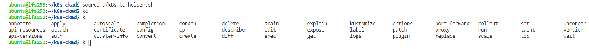

# Define kubectl shell helper functions

In order to save time when typing kubectl commands the following custom shell functions should be [sourced](#7-sample-shell-kubectl-helper-functions-file) inside the shell.

## 1. Define `vim` as the default shell editor

```bash
export TERMINAL=vim
```

## 2. Define `k` as an alias for the `kubectl` CLI

```bash
kc() {
  source <(kubectl completion bash)
  alias k=kubectl
  complete -F __start_kubectl k
}
export -f kc
```

## 3. Display the current kubectl context

```bash
cc() {
  kubectl config get-contexts $(kubectl config current-context)
  echo
}
export -f cc
```


---

## 4. Change the kubectl current namespace

```bash
cn() {
  kubectl config set-context --current --namespace=$1
  cc
}
export -f cn
```


---

## 5. Watch a kubectl command

```bash
w() {
  watch -n 1 -- "bash -c 'source k8s-kc-helper.sh;$1'"
}
export -f w
```


---

## 6. Watch a set of k8s resources

```bash
wk() {
  w "cc;kubectl get $1 --output=wide"
}
export -f wk
```


## 7. Sample shell kubectl helper functions file

[k8s-kc-helper.sh](../k8s-kc-helper.sh)

```bash
source ./k8s-kc-helper.sh
kc
```


