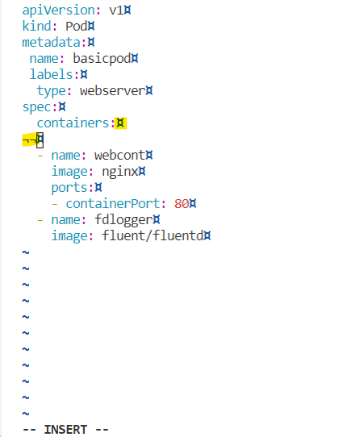

# Setup vim preferences

In order to ease yaml editing the following vim customization should be made inside the **`~/.vimrc`** file.

## 1. Define local vim settings specific to .yml and .yaml extension files

```vim
autocmd FileType yml,yaml setlocal tabstop=2 softtabstop=2 shiftwidth=2 expandtab list listchars=eol:¤,trail:¬
```

> :bulb:**[!TIP]**
> When editing files with `.yml` or `.yaml` extensions (`FileType`), the tabulations (`tabstop` and `softtabstop`) as well as shifts (`shiftwidth`) will be automatically (`autocmd`) expanded (`expandtab`) to **`2`** spaces. Moreover, character `¤`(ascii code **207**) will be displayed at end of line (`eol`) and character `¬` (ascii code **170**) will be displayed at trailing spaces (`list` and `listchars`).



---

## 2. Define vim settings common to all files

```vim
set autoindent smartindent rulers showcmd wildmenu
```

---

## 3. Define blue color scheme

```vim
colorscheme blue
```

---

## 4. Sample `.vimrc` file

[.vimrc](../.vimrc)
